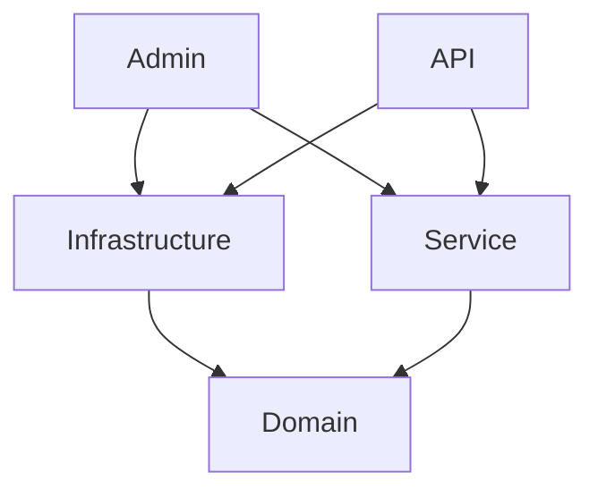

# ASP.NET MVC Clean Architecture Template
This project template provides the foundation for an ASP.NET MVC Core project, starting with an Administrative Site and an API.

## Getting Started
1. Setup your database
2. Configure an email provider
3. Configure Admin users seeding 

## Project Structure


Note that Service and Infrastructure cannot directly "see" each other. 
In general, the Service project leverages infrastructure functionality through interfaces defined in 
Domain.Contracts.

## Practices
### Entities
* Use "Dto" (Data Transfer Object) suffix for data models that transfer data at the Service layer from
  the underlying Entities to the Apps.
* Use "VM" (View Model) to transfer data from a Controller to the front end.
* Data entities should have no special suffix
* Please do not use object mappers.  Just do the mapping between
  entities, DTOs, and View Models manually, type it out.

## 3rd Party Services
### Sockethead.Razor
This library is used for these things:
1. SimpleGrid - a powerful grid for rendering, paginating, sorting, etc. a collection of records
2. TwoColumnGrid - for rendering a single record a Field and Value 
3. Alerts - display messages at the top of the page from a Controller

[Sockethead Demo Site](https://sockethead.azurewebsites.net/)

### Serilog
Serilog is the most popular logging framework for .NET.
It is configured in the Admin and API Program.cs files. 

### TUnit 
This library is brand new.  I've used xUnit before, but I really like the ability to control
dependencies with TUnit which I think is great for Integration Tests which I feel are far more
important than Unit Tests.

### Miscellaneous
1. Newtonsoft.Json - I'm not ready to abandon it just yet!
2. FluentValidation


## Features
### Database Support
1. The Entities are defined in Domain.Data
2. The Context is defined in Infrastructure
3. The Repo is defined in Service and is the way the Admin and API access the database 
4. The connection is initialized to a local app.db; obviously this should be switched to a real SQL database; we prefer **Postgres**.
5. Migrations are configured on the Infrastructure project 

Note: I have implemented an interface for the DbContext (in Domain.Contracts) but it is an 
unnecessary abstraction since the Controllers inject the Repository already, which is enough abstraction.

#### Create Migrations

``` bash
dotnet ef migrations add DescriptiveNameHere --context SocketheadCleanArchDbContext `
--project ./SocketheadCleanArch.Infrastructure/SocketheadCleanArch.Infrastructure.csproj `
--startup-project ./SocketheadCleanArch.Admin/SocketheadCleanArch.Admin.csproj
```

#### Update Database

``` bash
dotnet ef database update --context SocketheadCleanArchDbContext `
    --project ./SocketheadCleanArch.Infrastructure/SocketheadCleanArch.Infrastructure.csproj `
    --startup-project ./SocketheadCleanArch.Api/SocketheadCleanArch.Api.csproj
```

#### Delete Migration

``` bash
dotnet ef migrations remove --context SocketheadCleanArchDataContext `
    --project ./SocketheadCleanArch.Infrastructure/SocketheadCleanArch.Infrastructure.csproj `
    --startup-project ./SocketheadCleanArch.Api/SocketheadCleanArch.Api.csproj
```


