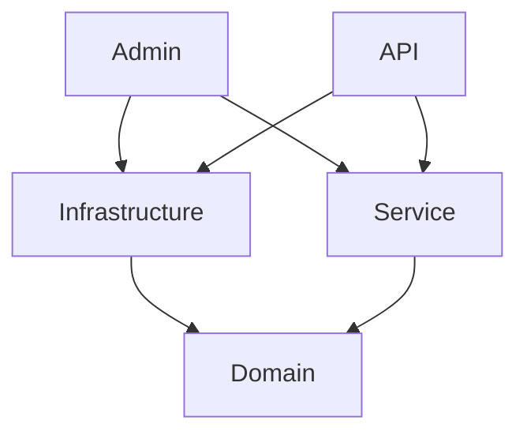

# Sockethead Clean Architecture Admin/API Template
## Purpose
This project template provides the foundation for an ASP.NET MVC Core project, starting with an Administrative Site and an API.

## Practices
* Please do not use object mappers.  Just do the mapping manually, type it out.
* 

## Project Structure

Note that Service and Infrastructure cannot directly "see" each other. 
In general, the Service project leverages infrastructure functionality through interfaces defined in 
Domain.Contracts.

## 3rd Party Services
1.  Sockethead.Razor
    * Grid
    * TwoColumnGrid
    * Alerts
* Serilog.AspNetCore
* Newtonsoft.Json - I'm not ready to abandon it just yet...
* 

## Features

### Database Support
1. The Entities are defined in Domain.Data
2. The Context Interface is defined in Domain.Contracts
3. The Context is defined in Infrastructure and implements the Context interface
4. The Repo is defined in Service and is the way the Admin and API access the database 
5. The connection is initialized to a local app.db; obviously this should be switched to a real SQL database; we prefer **Postgres**.
6. Migrations are configured on the Infrastructure project 

### Logging Support (Serilog)
1. We are using Serilog and is configured in Admin and API Program.cs

### 
