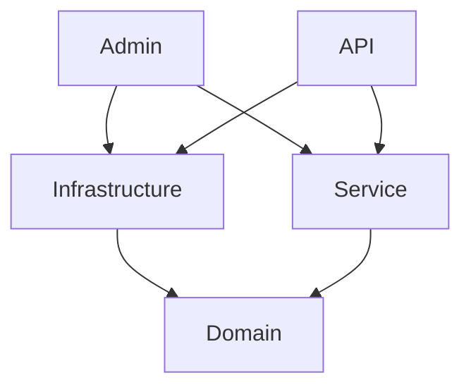

# ASP.NET MVC Clean Architecture Template
This project template provides the foundation for an ASP.NET MVC Core project, starting with a
MVC Administrative Site and API.

## Key Features
* Separate projects setup loosely based on Clean Architecture concepts
* Centralized configuration management (appsettings.json) to avoid configuration duplication
* Nice Serilog logging configurations appropriate for both local Development and Production
* Code First EF Core Database Setup with AppUser and Roles 
* User and role seeding mechanism
* Very basic User Admin UI to list users and assign roles
* Developer page with useful diagnostic information for troubleshooting
* API Documentation with Scalar with the ability to set the Bearer token in the UI
* API standard return object defined with helper methods to create and return
* API ProblemDetails and global Error Handler configured 
* Unit Testing Project setup with both xUnit and TUnit setup
* A WebApplicationFactory configured to bootstrap the API Project for testing
* TUnit tests demonstrating testing the APIs with authentication

More popular common features will be added over time.

## Getting Started

1. Setup your database
2. Configure an email provider
3. Configure Admin users seeding 

### Running the Project (Docker Compose)
```bash
docker compose up -d
```
or
```bash
podman compose up -d
```

The `.docker.env` file is used to set environment variables for the containers.

Note that the parameters in the database's health check are intentionally hard-coded. To pass parameters to the compose.yaml file,
you need to use a `.env` file instead of `env_file`. The `env_file` directive is used to pass environment variables to the container itself,
not to the Compose file. Therefore, if you change the parameters in the Compose file, you must also update them in the database's health check.

## Project Structure


Note that Service and Infrastructure cannot directly "see" each other. 
In general, the Service project leverages infrastructure functionality through interfaces 
defined in Domain.Contracts that are actually Implemented in Infrastructure.  On the other hand,
Infrastructure should never need anything from Service. 

The Service project will contain your Business Logic. Unlike the Infrastructure project,
objects defined in the Services project do not need interfaces. They can be tested by
mocking the interfaces that they depend on.

## Practices
### Entities
* Use "Dto" (Data Transfer Object) suffix for data models that transfer data at the Service layer from
  the underlying Entities to the Apps.
* Use "VM" (View Model) to transfer data from a Controller to the front end.
* Data entities should have no special suffix
* Please do not use object mappers.  Just do the mapping between
  entities, DTOs, and View Models manually, type it out.

## 3rd Party Services
### Sockethead.Razor
This library is used for these things:
1. SimpleGrid - a powerful grid for rendering, paginating, sorting, etc. a collection of records
2. TwoColumnGrid - for rendering a single record a Field and Value 
3. Alerts - display messages at the top of the page from a Controller

[Sockethead Demo Site](https://sockethead.azurewebsites.net/)

### Serilog
Serilog is the most popular logging framework for .NET.
It is configured in the Admin and API Program.cs files. 

### TUnit
TUnit is brand new and is particularly well suited to Integration Testing with its support for 
the "DependsOn" tag which allows you to control the dependency sequence. It is now easy to
have tests that build on state from previous tests, while still supporting parallel execution.
We really like this library. There are some issues and currently, the tests are not "discovered"
for me in Rider. But simply running executes very fast and has nice output.  
```shell
dotnet run 
```
[Running TUnit Tests](https://thomhurst.github.io/TUnit/docs/tutorial-basics/running-your-tests)

We are using the 

### xUnit
We also included xUnit in the test project. This is a good fallback if you run into problems or
don't like TUnit.

### Miscellaneous
1. Newtonsoft.Json
2. FluentValidation

## Features
### Database Support
1. The Entities are defined in Domain.Entities
2. The Context is defined in Infrastructure
3. The Repo is defined in Service and is the way the Admin and API access the database 
4. The connection is initialized to a local app.db; obviously this should be switched to a real SQL database; we prefer **Postgres**.
5. Migrations are configured on the Infrastructure project 

#### Create Migrations

``` bash
dotnet ef migrations add DescriptiveNameHere --context SocketheadCleanArchDbContext `
--project ./SocketheadCleanArch.Infrastructure/SocketheadCleanArch.Infrastructure.csproj `
--startup-project ./SocketheadCleanArch.Admin/SocketheadCleanArch.Admin.csproj
```

#### Update Database

``` bash
dotnet ef database update --context SocketheadCleanArchDbContext `
    --project ./SocketheadCleanArch.Infrastructure/SocketheadCleanArch.Infrastructure.csproj `
    --startup-project ./SocketheadCleanArch.Admin/SocketheadCleanArch.Admin.csproj
```

#### Delete Migration

``` bash
dotnet ef migrations remove --context SocketheadCleanArchDataContext `
    --project ./SocketheadCleanArch.Infrastructure/SocketheadCleanArch.Infrastructure.csproj `
    --startup-project ./SocketheadCleanArch.Admin/SocketheadCleanArch.Admin.csproj
```

